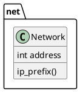
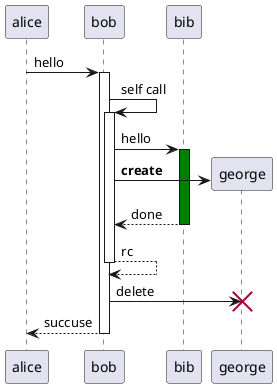
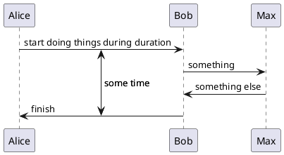
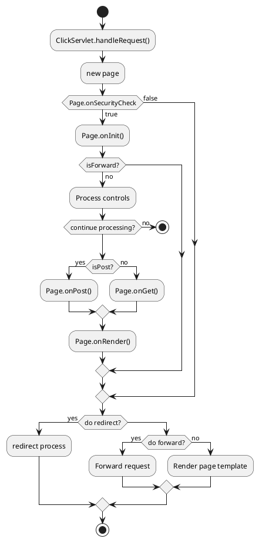
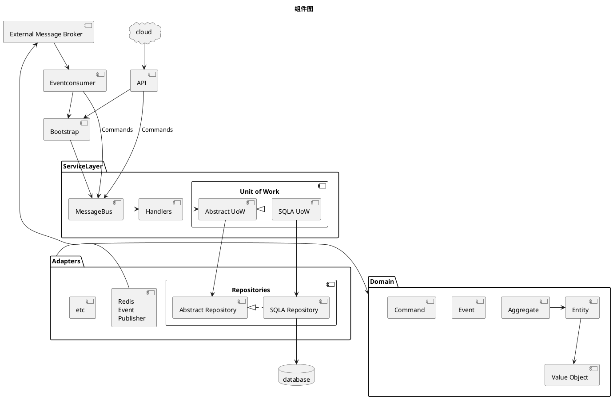
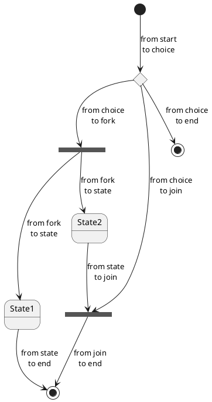
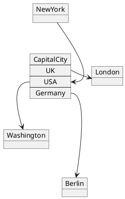
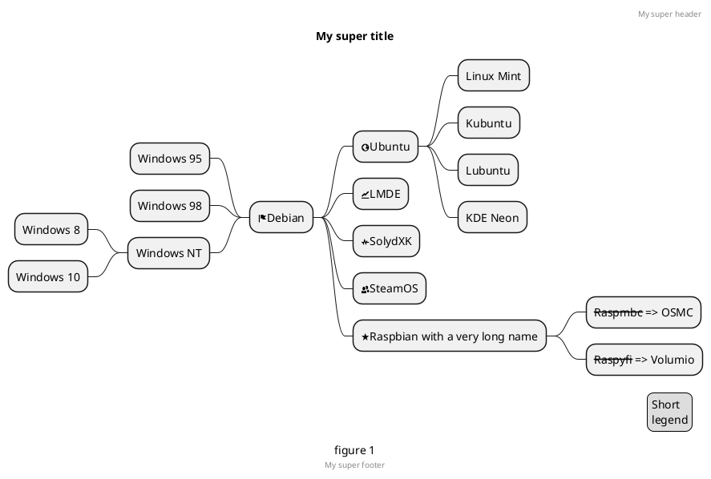

- [**所有图例汇总**](https://plantuml.com/zh/deployment-diagram)

## 类图


```plnatuml
@startuml
abstract        抽象
abstract class  抽象(等同abstract)
annotation      注解
circle          圆
()              圆缩写形式
class           类
diamond         菱形
<>              菱形写形式
entity          实例
enum            枚举
interface       接口
@enduml
```


线标记
- `--|>` 继承
- `--*` 组合
- `--o` 聚合

方法和属性的访问性质
- `+` public
- `-` private
- `#` protected
- `~` package

### 辅助布局

```plnatuml
@startuml

class Bar1
class Bar2
together {
  class Together1
  class Together2
  class Together3
}
Together1 - Together2
Together2 - Together3
Together2 -[hidden]--> Bar1
Bar1 -[hidden]> Bar2


@enduml
```

加入了`together`和`-[hidden]-`来支持辅助布局

### 命名空间




## 时序图


- ++ 激活目标（可选择在后面加上#color）
- -- 撤销激活源
- ** 创建目标实例
- !! 摧毁目标实例




锚点和持续时间




## 用例图


## 活动图




## 组件图




## 状态图




## 对象图




## 思维导图



